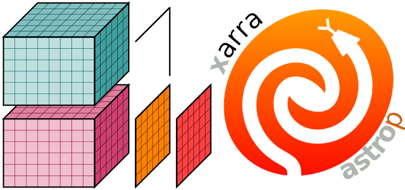

astropy-xarray
==============

Seamless interoperability between `astropy`_ and `xarray`_.

.. _astropy: https://docs.astropy.org/en/latest/
.. _xarray: https://xarray.pydata.org/en/stable

.. warning::

   This package is experimental, and new versions might introduce backwards incompatible
   changes.

Documentation
-------------

**Getting Started**:

- :doc:`installation`
- :doc:`examples`

.. toctree::
   :maxdepth: 1
   :caption: Getting Started
   :hidden:

   installation
   examples

**User Guide**:

- :doc:`terminology`
- :doc:`creation`
- :doc:`conversion`

.. toctree::
   :maxdepth: 1
   :caption: User Guide
   :hidden:

   terminology
   creation
   conversion

**Help & Reference**:

- :doc:`whats-new`
- :doc:`api`
- :doc:`contributing`

.. toctree::
   :maxdepth: 1
   :caption: Help & Reference
   :hidden:

   whats-new
   api
   contributing
